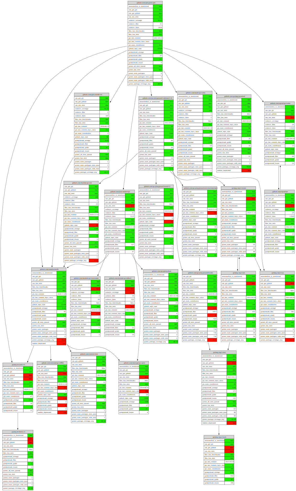

<h1 align="center">Go recipes 🦩 </h1>
<p align="center">Handy commands to run in Go projects</p>

### Find Go versions of upstream modules

> Use this when upgrading version of Go or finding old modules.

```bash
$ go list -deps -json ./... | jq -rc 'select(.Standard!=true and .Module.GoVersion!=null) | [.Module.GoVersion,.Module.Path] | join(" ")' | sort -V | uniq
1.11 github.com/ugorji/go/codec
1.11 golang.org/x/crypto
1.12 github.com/golang/protobuf
...
```

### Get directly dependent modules that can be upgraded

> Use this to keep your modules updated. Similar function is integrated in VSCode official Go plugin and GoLand, but you can run it as CLI too. May be useful if you use emacs or vim.

```bash
$ go list -u -m $(go list -m -f '{{.Indirect}} {{.}}' all | grep '^false' | cut -d ' ' -f2) | grep '\['
github.com/goccy/go-json v0.5.1 [v0.7.3]
github.com/golang/protobuf v1.3.3 [v1.5.2]
github.com/json-iterator/go v1.1.9 [v1.1.11]
...
```

### Find upstream modules without Go version

> Use this to find outdated modules or imports that you need to upgrade

```bash
$ go list -deps -json ./... | jq -rc 'select(.Standard!=true and .Module.GoVersion==null) | .Module.Path' | sort -u
github.com/facebookgo/clock
golang.org/x/text
gopkg.in/yaml.v2
...
```

### Make histogram of Go files per package

> Use this to see when package is too big or too small. Adjust histogram length to maximum value.

```bash
$ go list -json ./... | jq -rc '[.ImportPath, (.GoFiles | length | tostring)] | join(" ")' | perl -lane 'print (" " x (20 - $F[1]), "=" x $F[1], " ", $F[1], "\t", $F[0])'
  ================== 18	github.com/gin-gonic/gin
       ============= 13	github.com/gin-gonic/gin/binding
                   = 1	github.com/gin-gonic/gin/internal/bytesconv
                   = 1	github.com/gin-gonic/gin/internal/json
         =========== 11	github.com/gin-gonic/gin/render
```

### Find packages without tests

> If code coverage does not report packages without tests. This should be fast and good for CI.

```bash
$ go list -json ./... | jq -rc 'select((.TestGoFiles | length)==0) | .ImportPath'
github.com/gin-gonic/gin/ginS
github.com/gin-gonic/gin/internal/json
...
```

### Make graph of upstream packages

> Use to find unexpected dependencies, visualize project. Works best for small number of packages, for large projects use `grep` to narrow down subgraph. Without `-deps` only for current module.

```bash
$ go list -deps -json ./... | jq -c 'select(.Standard!=true) | {from: .ImportPath, to: .Imports[]}' | jsonl-graph | dot -Tsvg > package-graph.svg
```


### Scrape details about upstream modules and make graph

> Use to find low quality, unmaintained dependencies.

```bash
$ go mod graph | import-graph -i=gomod | jsonl-graph -color-scheme=file://$PWD/basic.json | dot -Tsvg > output.svg
```


## Prerequisites

```bash
# get https://graphviz.org/download/
# get https://stedolan.github.io/jq/download/
$ go install github.com/nikolaydubina/jsonl-graph@latest
$ go install github.com/nikolaydubina/import-graph@latest
$ go mod download
```

## Contributions

.. are welcomed! 🤝
